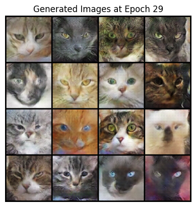
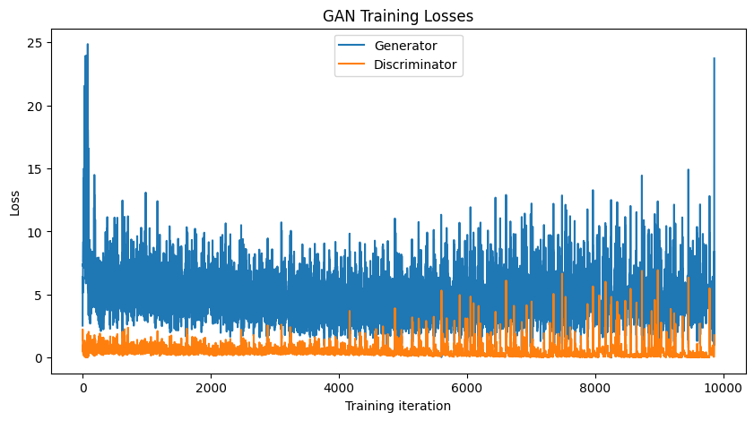
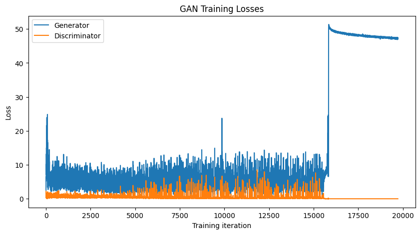

# GAN Cat Faces 🐱

> **Results at a glance:** Trained **<N> epochs** on a Colab **<GPU type>** GPU · DCGAN
> (100-dim latent) · Checkpoint + resume support across sessions · Fixed latent vector
> tracked for a consistent epoch-by-epoch progress GIF

DCGAN trained from scratch on the [Cats Faces 64×64](https://www.kaggle.com/datasets/spandan2/cats-faces-64x64-for-generative-models)
dataset, generating novel cat face images from random noise. Training can be paused and
resumed across multiple sessions using full checkpointing (model + optimizer state + loss
history), and every epoch's sample grid is drawn from the same fixed latent vector so
progress is directly comparable across the run.

## Overview

This project implements a DCGAN — a generator/discriminator pair trained adversarially — to synthesize cat face images. It includes:

- A from-scratch DCGAN architecture (transposed-conv generator, strided-conv discriminator)
- Checkpointing every N epochs with full resume support (model + optimizer states + loss history + fixed noise vector), so training can be paused and continued across multiple sessions
- A fixed latent vector tracked across epochs, so the sample grid shown at each epoch reflects the *same* points in latent space evolving over training — not unrelated random draws
- Loss curve tracking and plotting
- A standalone inference cell to generate new images from any saved checkpoint

## Results

**Sample outputs (epoch 29 — selected as the best pre-collapse checkpoint, see loss analysis below):**

**Training loss:**

Loss history is preserved across the checkpoint/resume workflow — the two plots below
are continuous (no reset at the epoch-20 resume boundary), confirming optimizer and loss
state restore correctly.

Around epoch ~31, the discriminator overpowered the generator (D loss → ~0, G loss
spikes and plateaus ~47–48) — a common GAN failure mode where D becomes too confident
and G's gradient saturates. Training continued to epoch 39, but the best visual results
came from epoch 29, before the collapse; that's the checkpoint used for the sample grid
above.

Trained for 39 epochs total on a `<GPU type, e.g. Colab T4>` GPU, `<total training time>`,
split across two sessions using the checkpoint/resume workflow.
## Architecture

| | Generator | Discriminator |
|---|---|---|
| Input | 100-dim latent vector | 64×64×3 image |
| Layers | 5× `ConvTranspose2d` + BatchNorm + ReLU, final `Tanh` | 5× `Conv2d` + BatchNorm + LeakyReLU(0.2), final `Sigmoid` |
| Output | 64×64×3 image | Real/fake probability |

Standard DCGAN weight initialization (`N(0, 0.02)`) is applied to all conv and batchnorm layers. Optimized with Adam (`lr=0.0002`, `beta1=0.5`) for both networks, trained with binary cross-entropy loss.

## Running it

1. Open `gan_cats.ipynb` in Google Colab (badge above) or locally with a GPU.
2. Run all cells top to bottom. This downloads the dataset via `kagglehub`, trains the DCGAN, and saves sample grids to `samples/` and checkpoints to `checkpoints/` every 2 epochs.
3. **To resume training later** (e.g. you trained 10 epochs, now want 20 total): re-run the "Resume Training" cell with `num_epochs` set to your new total and `resume_training = True`. See the notebook's Resume Training section for details.
4. **To generate images from a saved checkpoint** without retraining, use the `generate_images()` cell near the end of the notebook.

## Credits

- Dataset: [Cats Faces 64x64 for Generative Models](https://www.kaggle.com/datasets/spandan2/cats-faces-64x64-for-generative-models) by spandan2 on Kaggle.
- Architecture follows the standard DCGAN design from [Radford et al., 2015](https://arxiv.org/abs/1511.06434).

## License

<!-- TODO: pick a license, e.g. MIT -->
MIT
